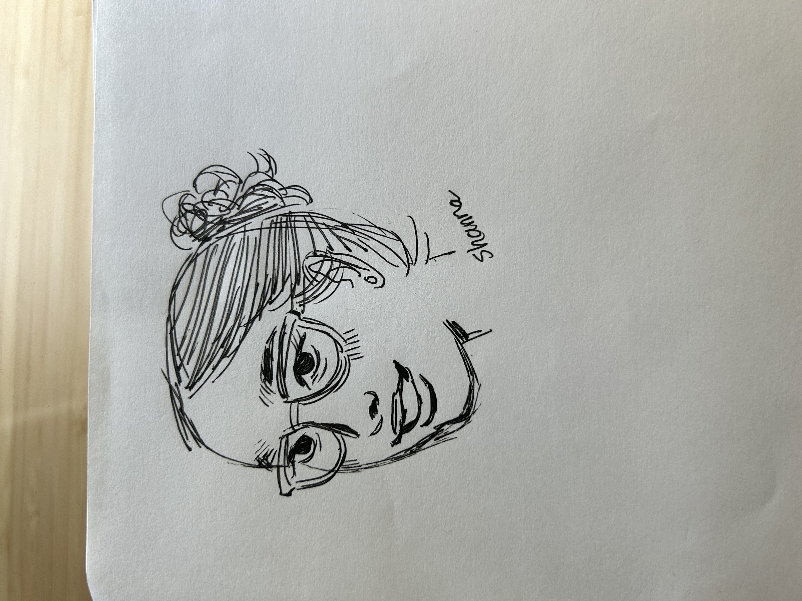
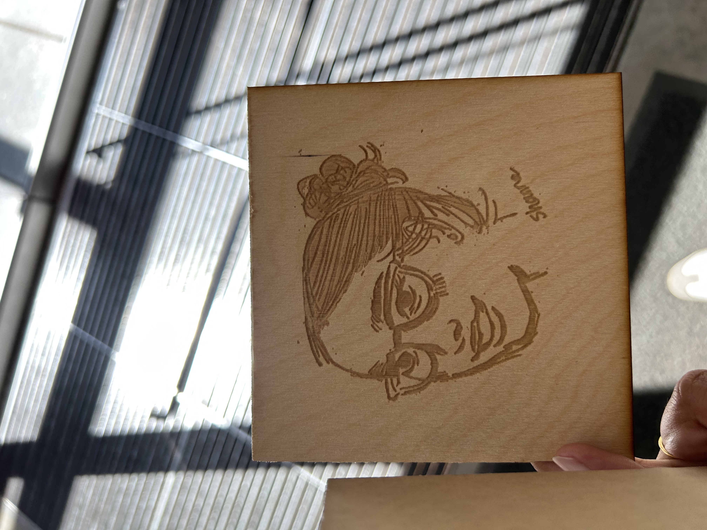
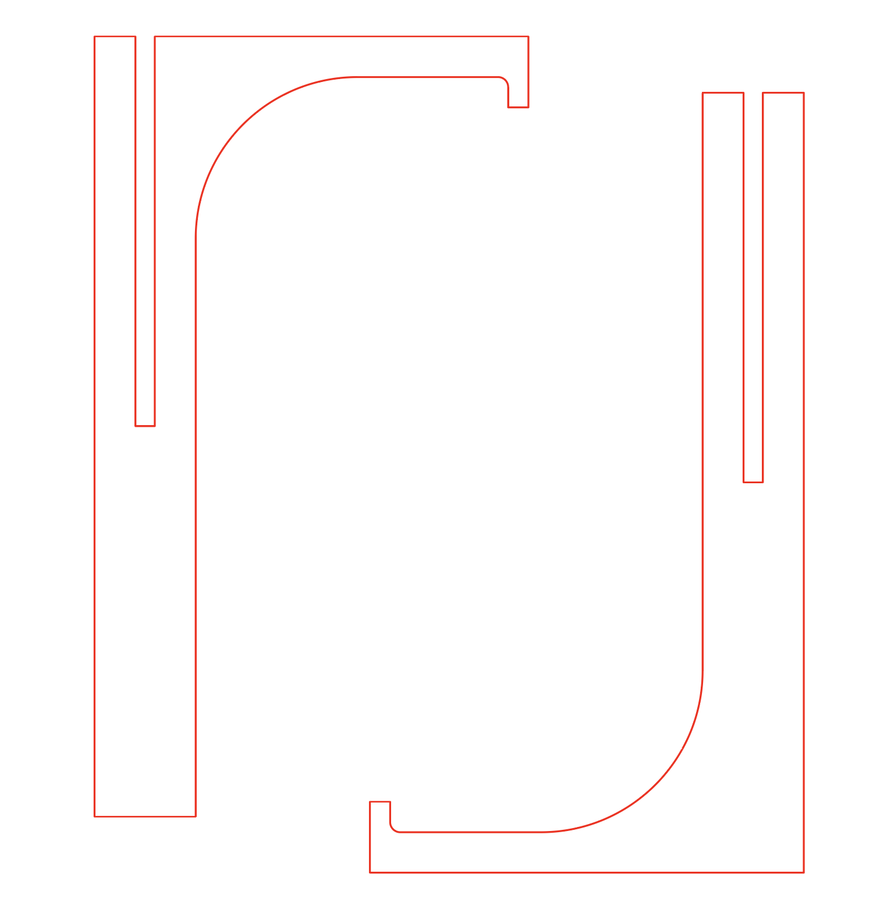
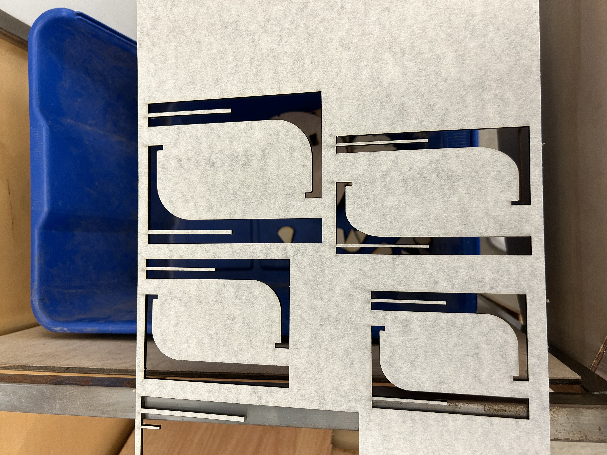
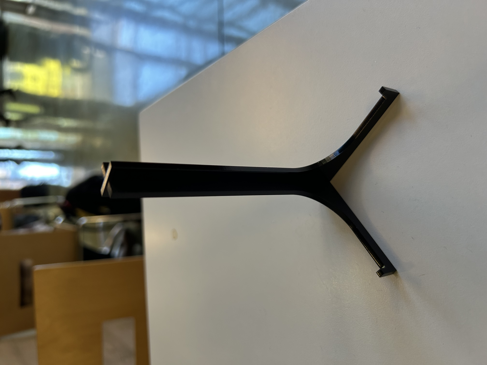
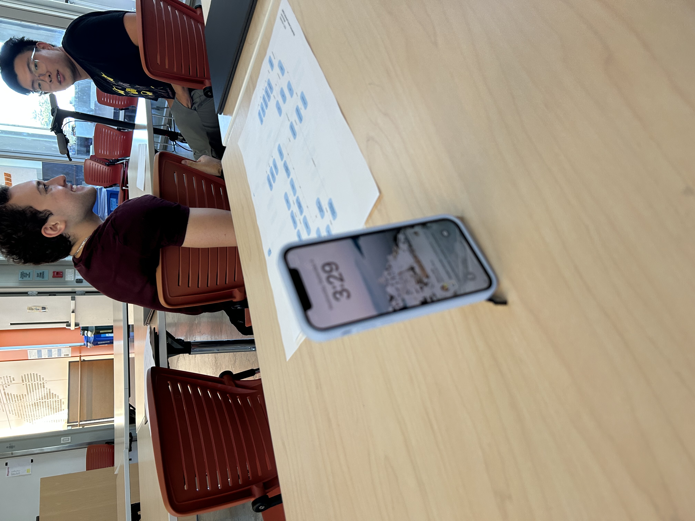
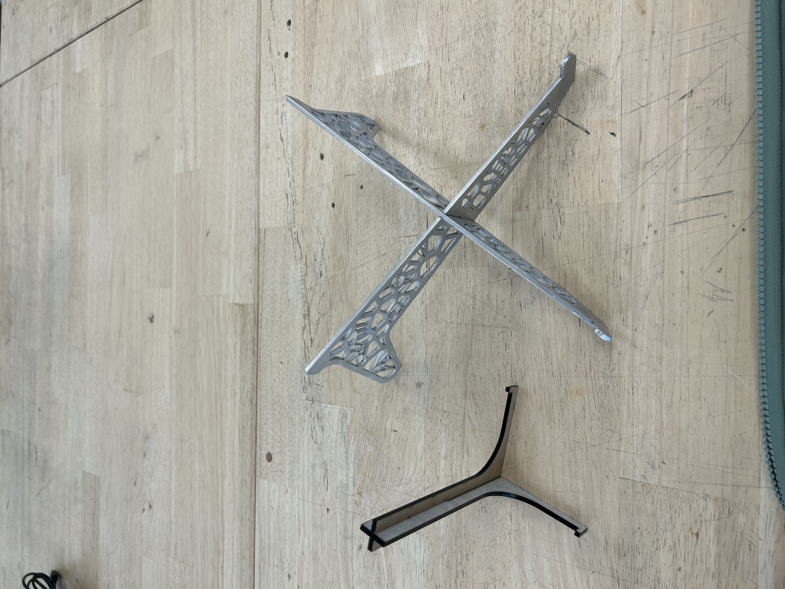
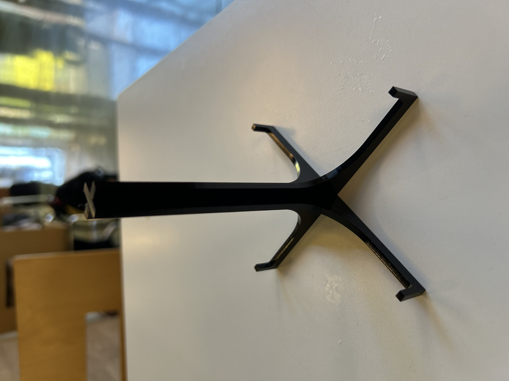
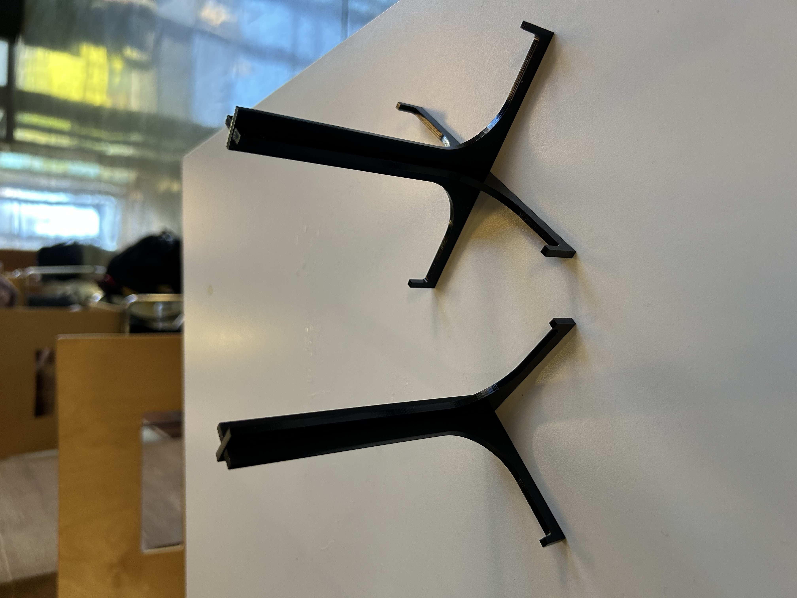
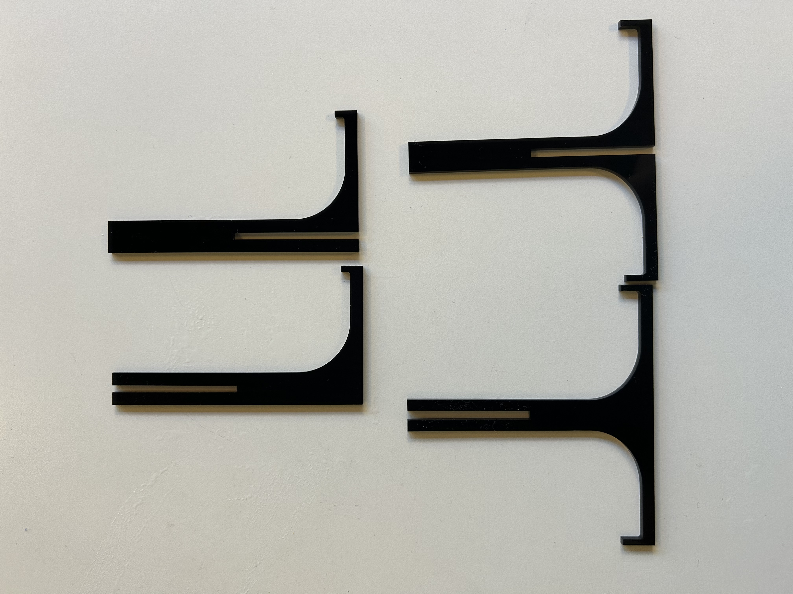

# Intro

Hi! I'm an MDes student at Berkeley, learning how to make cool things and keeping track of my progress here!

[Week 5](README.md#week-5)

[Week 4](README.md#week-4)

[Week 3](README.md#week-3)

[Week 2](README.md#week-2)

[Week 1](README.md#week-1)

---

# Week 5 #

9/29:

I experimented with the provided files for interacting with the Photon 2. I followed the provided diagram to connect two LEDs and a button to the Photon.

Though the diagram has only one LED, I was able to add another by pattern matching it how the first one was constructed.

Reflections:

I tried changing a few variables in the provided files, mainly the timing for the LED blinking and some of the log statements. 

https://github.com/user-attachments/assets/1c6235a0-b5f7-4c6b-99c6-cdfc157e3c7e

Description: Provided periodicity timing of 3 seconds

https://github.com/user-attachments/assets/ddfffd97-8bda-4f1d-87f2-9a397ce49491

Description: Changing the periodicity timing to 300ms to blink more rapidly

https://github.com/user-attachments/assets/deb610e1-e13c-4baf-a8a1-f878948cd53d

Description: changing the print statements to say "Hi roopa" when publishing to the cloud.

I don't have much knowledge on circuits, so it was hard for me to think about adding other elements to the breadboard and how I would do that other than pattern-matching what was already provided. I felt that the code in the introductory tutorials was fairly basic, so I didn't think there was much to change other than periodicity intervals or print statements. 

Speculations:

Since this system has a timing element and can publish things to the cloud, I think it would be interesting to get some wearable sensors (e.g. sweat sensor) and see if it can talk to the Photon via the cloud. The Photon could run some code that uses machine learning to analyze my exercise and activity patterns. I want to look into how sensors can talk to the Photon in real time if that's even possible, or if data has to be collected async and then fed into the Photon.

In terms of ecosystems missing from my daily life, I'm missing ecosystems that analyze my daily habits and patterns OTHER than my physical activity. For example, how often do I miss a certain bus in the morning? It feels like I don't miss it that much, but the data will probably tell me otherwise. How often do I complete my homework for this class ahead of the deadline? I think the Photon will lend itself well to analyzing patterns, and this is something I want to explore.

Part 2:

# Week 4 #

Reflections:

Wrapping up Assignment 1 concluded with turning in my pdf report on Monday. I also ended up printing out a couple of more iterations of my laptop stand design, based on my peer feedback.  

For this week's assignment/intro to Assignment 2, I spent time thinking about what are the steps involved in me watching "Emily in Paris" (latest season!) on TV. They're depicted in the below diagram:

Description:

The diagram shows the steps that are involved (both in terms of user interaction and data flow) in watching "Emily in Paris" on a smart TV. The purple circles depict the feedback that the user (me) receives after interacting with the system components (green circles). The labeled arrows represent actions performed by the user interacting with the system (purple) or by the system component in interacting with another system component (green). The user interaction in this example is fairly simple, but how the system components interact with each other is pretty complex. It involves hardware - hardware interactions, as well as software - hardware interactions and vice versa. 

Speculations:

I don't know much about hardware -> software connections. I know the basics of software interactions such as HTTP requests and data flow, but I don't know what happens in the preceding/following steps when data interacts with hardware. I think it was difficult to create a diagram that depicts both feedback and data flow without making it too confusing. I may revise this diagram to include more specific hardware interactions after I learn a little bit more about them.

I'm excited to work on a hybrid hardware/software system since I've worked extensively with software but barely any hardware. I think it will be interesting to explore the limits of systems where multiple Photons can talk to each other.

# Week 3 #

Panic!! I spent a lot of time trying to figure out what I wanted to make for my assignment. I initially thought about a car phone stand for my mom since she needs one, similar to one of these. But I reasoned that it didn't make sense because I don't have a car to test my prototypes in.

Phone stand that fits in cupholder:

Then I thought about making a phone stand in a fun shape but didn't feel inspired by anything.

Finally, I literally looked around my room and realized that what I really needed was a laptop stand. Watch my video to get a complete idea of the process.
https://www.youtube.com/watch?v=7i8T8viewTo

Reflections:

I learned a lot about how computational design could enable me to iterate on designs quickly and check their feasibility via modeling. It was helpful to simulate the size and approximate physical properties of my laptop via parametric models so that I could see immediately how my stand would be affected by certain changes. Ideally, I would try to use some weight simulation plugins on Grasshopper, as that's probably the most important consideration of a laptop stand. Even so, I spent so much time on this assignment in the past week that I couldn't have done it as part of this. This is an exploration for the future.

Speculations:

My laptop stand is in a good initial state with feasibility. But it's kind of ugly, to be honest. I plan to print another iteration over the weekend that is more stylized. Cody from the makerspace had a really interesting suggestion for a design which uses a box to intersect my current design. This will make it look more stylized AND should greatly reduce the print volume and time. I will also see what my peer feedback looks like and iterate considering that too. I also plan to ask Cody about Kangaroo2 for weight simulations since he mentioned he had some experience with the plugin.

Proposed revision (or something similar to this):

# Week 2 #

Part 1: Playing around with Rhino/Grasshopper

Attempting to break down the example cell phone stand Rhino/Grasshopper files into a more digestible format. The FigJam flowchart shows all of the elements that go into making the cell phone stand. The yellow triangles represent adjustable parameters (important!)

My diagrammatic understanding of the provided file:

On a quest to gain more understanding around what was happening in the example file, I began playing around with the previews and parameters. Initially, I didn't understand how two spheres + a box were used to construct the phone stand. When I turned on the previews for each shape, I saw how the intersections of the shapes led to the shape of the stand. 

My experiments to understand boolean geometry:

I also didn't understand what the purpose of the cylinder void was. But when I changed the cylinder radius to 0 and baked the geometry, I saw why it was important in reducing the print volume.

My experiments to understand boolean geometry, continued:

I wanted to see a full view of the stand along with the relevant elements - the table, the student, and the phone - so I turned on the booleans for all of them.

Full view of all parametric modeling:

I tried adjusting the radii of the spheres to see the minimum required sizes to still create a feasible phone stand. Something that I was curious about was why we needed two spheres to create the phone stand - it seemed like one would suffice. To test my hypothesis, I set the radius of the top sphere to 0. The software told me that the assembly was still good. 

Checking the necessity of the geometry:

I tried baking this configuration and produced a much smaller stand which seemed compatible with the phone centroid and angle, and would print quicker due to the reduced volume. However, we're not accounting for the weight of the phone in the assembly check, so maybe the smaller stand wouldn't work in this regard. We'd only be able to tell by printing!

Checking the necessity of the geometry:

Lastly, I tried a few experiments in replacing the nested spheres with different shapes to try creating different phone stand configurations.

I wanted to start with singular simple shapes - a box and a cylinder. The asssembly checks failed for both of these because the phone wasn't sitting properly in the stand. I think this was due to the support for both sides of the phone being the same height.

Replacing the geometry with a box:

Replacing the geometry with a cylinder:

I tried out a nested box configuration next, very similar to the nested sphere configuration. This passed the assembly checks.

Replacing the geometry with nested boxes:

Part 2: More experimentation with Rhino/Grasshopper

First, I attempted another version of a process diagram for the Grasshopper file (phone stand with context). I was inspired by one of the lecture diagrams that had grouped the process into a few categories that were easy to understand. I tried to emulate this with my new process diagram:

Lecture slide:

My revised diagram:

I think this grouping makes more sense than my previous attempt. 

I experimented with more parameters in the given Grasshopper file. 

Adjusting iPhone sizes in the parameters:

 

I also adjusted the z-positions of the nested spheres to observe the change in geometry and how it would affect the assembly. Sphere 1's z-position seemed to affect the assembly status more than Sphere 2.

Experimenting with the relative position of the spheres:

Lastly, I wanted to correct my failed attempt to use a cylinder in the phone stand geometry. I learned from Monday's lecture that my earlier cylinder failed because it was not capped. Armed with this knowledge, I was able to successfully create + bake a nested cylinder and box structure for the phone stand.

Successful geometry replacement:

All of the forms I tried baking (left to right: my new geometry, nested spheres with altered z-position, original stand):

Reflections:

This may sound silly, but one of my biggest learnings from this week was that I need to remember that we are working in 3D geometry. I need to ensure that all the shapes are closed, that they are on reasonable planes, and they are actually extruded.

Speculations: 

In real life, we'd need to consider different phone sizes to ensure the stand will work for a variety of users. I tried to model the phone on different iPhone sizes, from the 15 pro max (largest, left) to the SE (smallest, right). The change in iPhone size didn't seem to have an effect on the assembly of the stand. I want to explore Kangaroo2 in the future to see how to conduct weight simulations. This seems crucial to designing and modeling load-bearing 3d structures.

# Week 1 #

This week, I focused on getting into the rhythm of school and TDF!

I'm brand new to both laser-cutting and 3d printing, so I decided to focus on learning/practicing laser cutting for this week. 

During one of our warm-up activities for Studio Foundations, we had to draw a portrait of the person sitting next to us. I loved the portrait that Shanna drew of me so much, I decided to etch it into plywood as my first laser cutting project.

Original drawing:

I worked with a Jacobs design specialist to convert the drawing into a grayscale, vectorized image in Adobe Illustrator, which provided the template to the laser cutter. I played with different laser settings to find an optimal setting for etching the drawing.

Laser-etched portrait:

LATER THAT WEEK...

After hearing my cohort-mates talk about some of their laser-cut projects, I felt inspired to try another one. This time, I wanted to focus on cutting out interesting shapes rather than etching. In the spirit of our first assignment, I decided to make a phone stand.

My constraints with laser cutting a phone stand were as follows:
- Shape: essentially 2d objects needed to be cut and put together to create a 3d phone stand
- Materials: I didn't want to pay for material, so I used Jacobs scrap material - found a thn but durable black acrylic sheet.

Keeping these constraints in mind, I decided to make a phone stand that looked like a mini easel (example below - source: Instacart.com). I knew that my design and laser cut shapes would need to have slots to fit together since I didn't want to use hinges or other joinery.

I found a laser cut template online ([link](https://community.glowforge.com/t/picture-stand/10458)), which I converted into something cut-able in Adobe Illustrator.

I experimented with cutting out a bunch of different sizes of the template before landing on a size that supported my own phone well.

Laser cutter trial and error:

A decent-sized phone stand:

I even tested it with Lauryn's phone (kind of a fail):

There was room for improvement. For one, due to the lack of back support, the stand was front-heavy. It also didn't support different sizes of phones very well. Cody (design specialist) suggested adding some back support to my design and showed me an example of a laptop stand he had cut for himself which informed my second iteration.

I decided to modify the original template to better suit these needs. I extended the design to make it symmetrial (adding back support), and adjusted the size of the slots (adding wiggleroom to make the stand narrower or wider) I also made the curved ends a little longer so that the phone wouldn't slide out as easily. The result was the following:

Side by side of prototype stages:

Flat:

Much improved! 

Reflections:
Overall, I was able to practice iteration and prototyping through this exercise. I really enjoyed it. I think something I could improve on is prototyping a little more rapidly and giving myself a timebox (I could iterate on this design forever). 

I still need to find more users to test this version with. 

I also got started with some Rhino tutorials, but I have a lot more to go through before I start to feel comfortable (I probably could have redirected some of the laser cutting time to learning Rhino). 

Speculations:
For future versions, I want to try 3d-printing a similar design with a material that grips the phone better, like rubber. One of my goals before the weekend is to 3d print something simple!

